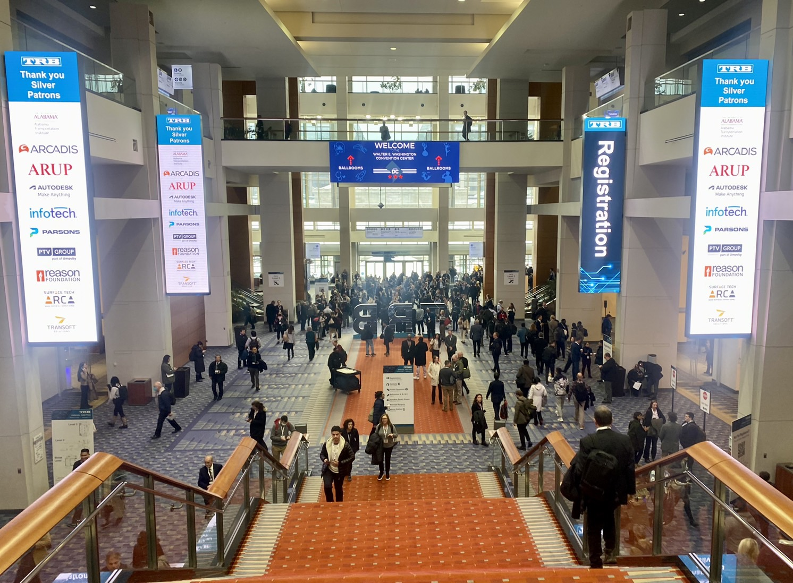
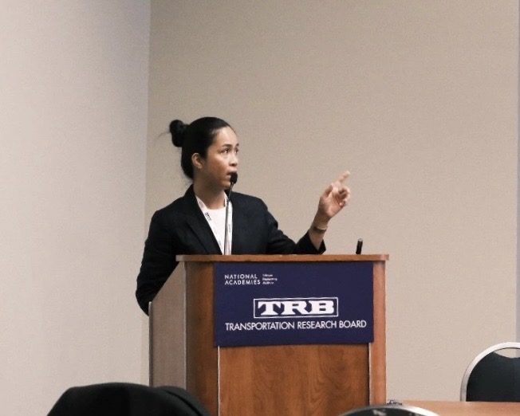
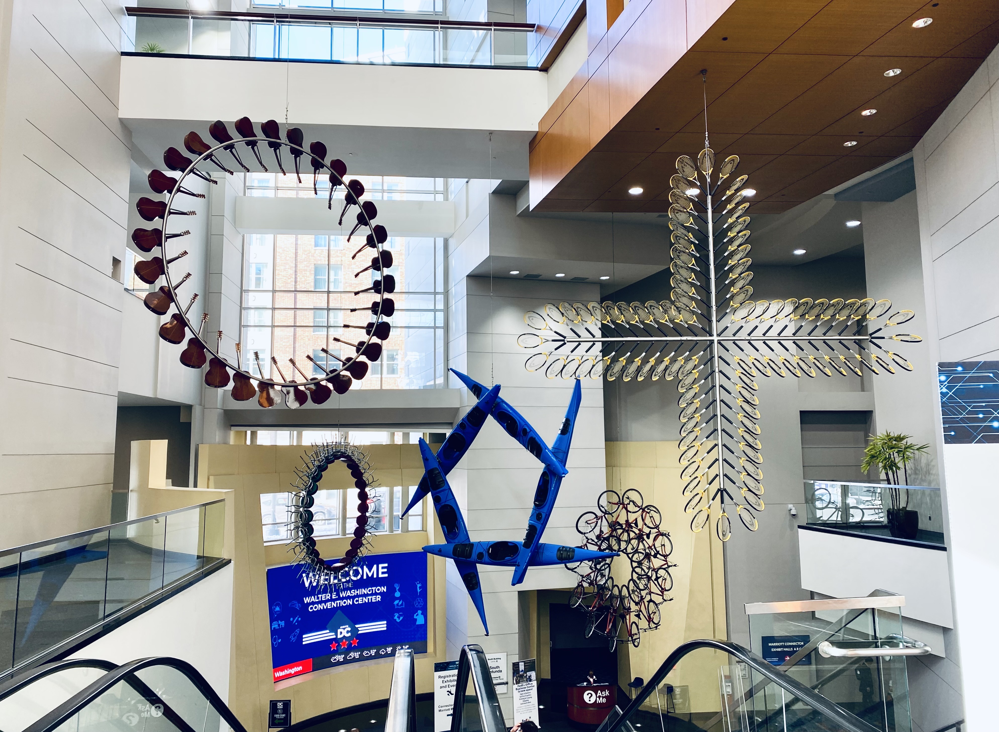

## About me

Enthusiastic graduate student with a Master’s degree in Transport and Geoinformation Technology from Stockholm, Sweden, and proven success in utilising transport data analytics to assess the impact of disruptions on passenger travel patterns. Demonstrates strong problem-solving abilities and experience in strategic planning and client relationship management. Actively seeking a challenging role in the sustainable transport sector. 

I am particularly interested in transport planning and urban mobility, such as leveraging transport data analysis to assist traffic planners in decision-making processes related to urban mobility and land use. I am also passionate about managing disruptions in multimodal transport systems and enhancing service and operational design to better serve people. My ultimate goal is to promote sustainable cities with efficient public and road transport systems.        



## News

  
  
  

- **[Jan. 2025]** I presented 'A Smart-card Based Analysis of During and Post-Disruption Impacts on Public Transport Passengers' Travel Pattern in Transport Research Board Annual Meeting 2025 at Walter E. Washington Convention Center, Washington DC, the United States of America 
- **[Nov. 2024]** The paper is accepted for presentation at Transportforum 2025 in Linköping, Sweden. Wilco Burghout will be the presenter
- **[Oct. 2024]** The paper is accepted for presentation at the 2025 Transport Research Board Annual Meeting in Washington, DC.
- **[Aug. 2024]** We submitted our paper to a conference, Transportforum 2025 by the Swedish National Road and Transport Research Institute (VTI).
- **[Aug. 2024]** My degree certificate was issued, and the degree project has been published on DiVa Portal.
- **[Jul. 2024]** We submitted our paper to Transport Research Board Annual Meeting 2025 (TRBAM25) for oral presentation.
- **[Jun. 2024]** I gave the final presentation of my degree project at the Transport Divison, KTH, with my examiner, supervisors, friends and family.








