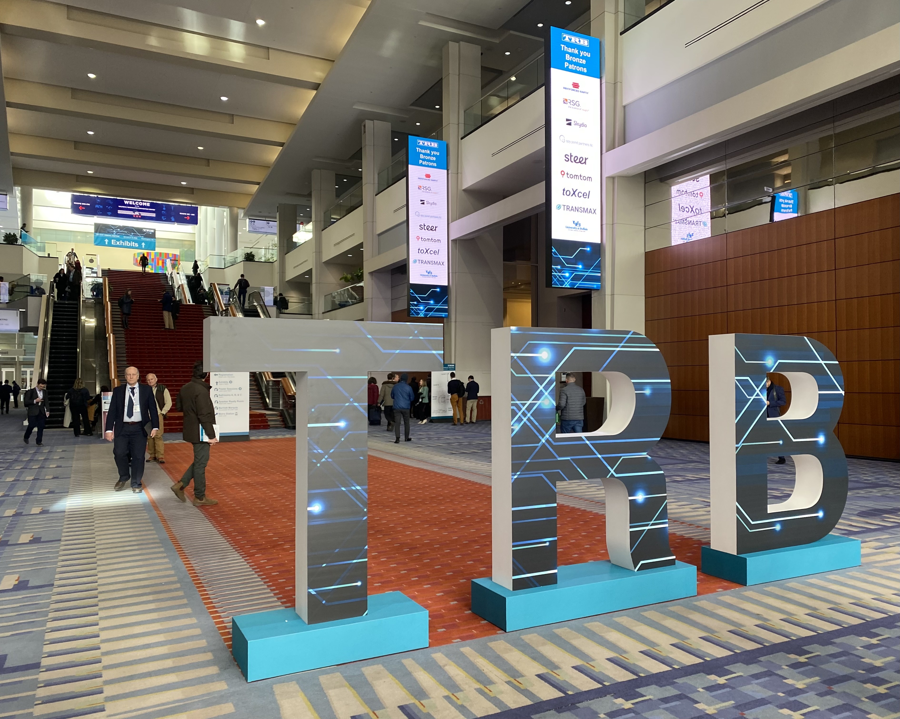
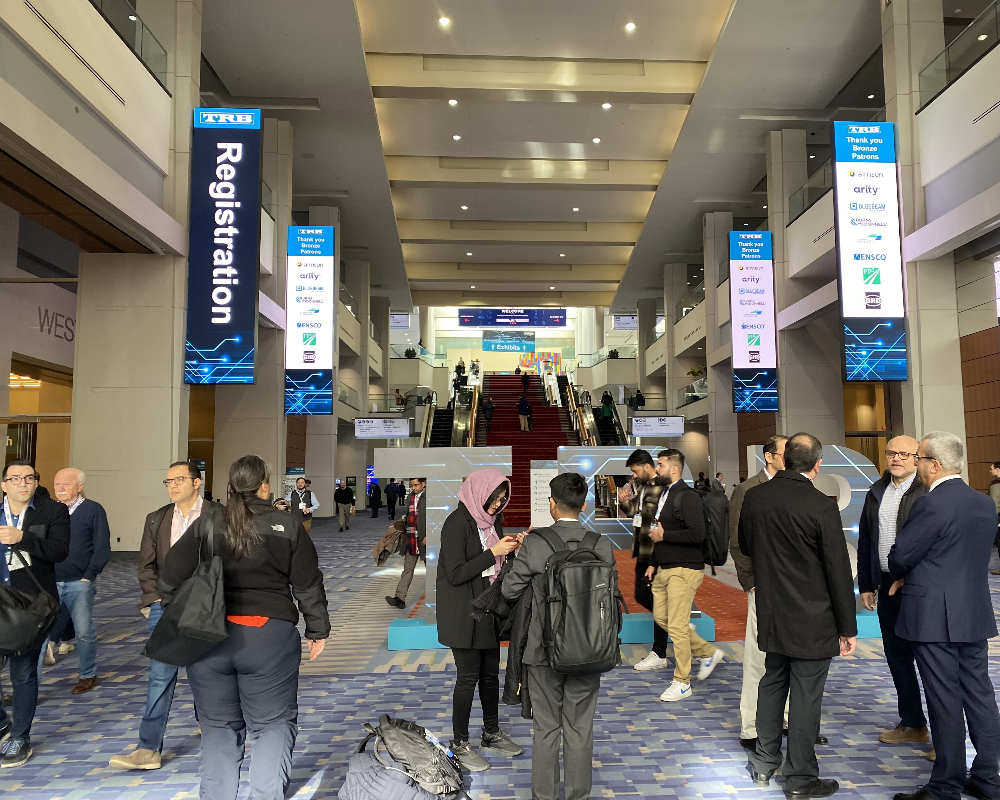

## About me

Master’s graduate in Transport and Geoinformation Technology, Sweden, with a Civil Engineering background and five years experience delivering major railway infrastructure projects, including track duplication and LNG terminal construction. Skilled in quality control, construction drawings, project monitoring, and multidisciplinary coordination. Proficient in transport planning and data analysis (AFC, AVL, GTFS). Presented Master's thesis at TRB 2025 in Washington D.C., analysing multimodal passenger impacts of an unplanned rail disruption in Stockholm. Passionate about advancing sustainable and efficient transport systems.         



## News

  
  
  

- **[Jan. 2025]** I presented 'A Smart-card Based Analysis of During and Post-Disruption Impacts on Public Transport Passengers' Travel Pattern in Transport Research Board Annual Meeting 2025 at Walter E. Washington Convention Center, Washington DC, the United States of America 
- **[Nov. 2024]** The paper is accepted for presentation at Transportforum 2025 in Linköping, Sweden. Wilco Burghout will be the presenter
- **[Oct. 2024]** The paper is accepted for presentation at the 2025 Transport Research Board Annual Meeting in Washington, DC.
- **[Aug. 2024]** We submitted our paper to a conference, Transportforum 2025 by the Swedish National Road and Transport Research Institute (VTI).
- **[Aug. 2024]** My degree certificate was issued, and the degree project has been published on DiVa Portal.
- **[Jul. 2024]** We submitted our paper to Transport Research Board Annual Meeting 2025 (TRBAM25) for oral presentation.
- **[Jun. 2024]** I gave the final presentation of my degree project at the Transport Divison, KTH, with my examiner, supervisors, friends and family.








